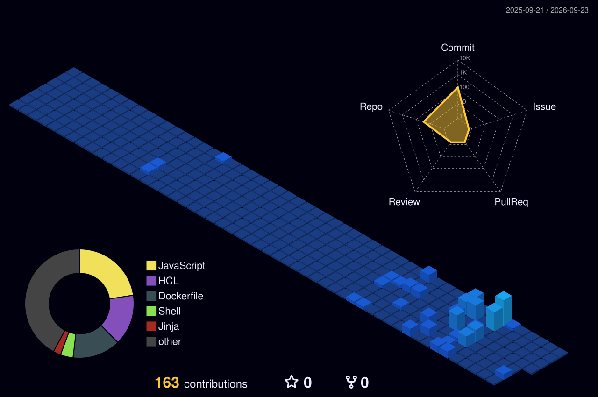

# 👋 Hi, I'm Rachamalla Shiva Shankar Goud

### 🚀 Aspiring DevOps Engineer | AWS | Linux | Terraform | Ansible | Docker | Kubernetes | CI/CD

I’m an **Aspiring DevOps Engineer focused on cloud infrastructure, automation, containerization, and deployment workflows**.

I build hands-on projects around AWS infrastructure, Infrastructure as Code, configuration management, containers, Kubernetes, and automation. I enjoy troubleshooting infrastructure issues and understanding how systems work from the ground up.

---

## 🧑‍💻 About Me

* ☁️ Building and automating infrastructure on **AWS**
* 🏗️ Writing Infrastructure as Code using **Terraform**
* ⚙️ Automating configuration and deployments with **Ansible**
* 🐳 Working with **Docker and containerized applications**
* ☸️ Working with **Kubernetes and EKS**
* 🔄 Learning and implementing **CI/CD pipelines**
* 🐧 Working with **Linux and Shell Scripting**
* 🔐 Learning AWS networking, security, and infrastructure best practices
* 🎯 Looking for **DevOps, Cloud, Infrastructure, and DevOps Internship opportunities**

---

# 🛠️ Tech Stack

| Category                          | Technologies                                                                                                  |
| --------------------------------- | ------------------------------------------------------------------------------------------------------------- |
| ☁️ **Cloud**                      | AWS · EC2 · VPC · IAM · S3 · Route 53 · ALB · EBS · CloudFront · ACM · EKS · SSM                              |
| 🏗️ **Infrastructure as Code**    | Terraform · Modules · Variables · Data Sources · Workspaces · Remote State · Multi-Environment Infrastructure |
| ⚙️ **Configuration Management**   | Ansible · Roles · Templates · Variables · Handlers · Automation                                               |
| 🐳 **Containers & Orchestration** | Docker · Docker Images · Docker Networks · Kubernetes · EKS · Deployments · Services · ConfigMaps · Secrets   |
| 🔄 **CI/CD & Version Control**    | Git · GitHub · Jenkins · CI/CD Pipelines · Build Automation · Deployment Automation                           |
| 🐧 **Linux & Scripting**          | Linux · RHEL · Bash · Shell Scripting · System Administration · Troubleshooting                               |

---

# 🚀 Featured DevOps Projects

## 🛒 Roboshop DevOps Infrastructure

**AWS · Terraform · Ansible · Linux · Docker · Kubernetes**

A hands-on DevOps project focused on automating infrastructure and deploying a multi-component application.

### 🔧 What I worked on

* AWS infrastructure provisioning using Terraform
* Reusable Terraform modules
* Multi-environment infrastructure
* AWS networking and security configuration
* EC2-based application infrastructure
* Configuration management using Ansible
* Linux server administration
* Application deployment and troubleshooting
* Containerized workloads using Docker
* Kubernetes-based application deployments

🔗 **Repository:**
https://github.com/rachamalla-shivv/roboshop-dev-infra

---

## 🏗️ Terraform AWS Infrastructure

**Terraform · AWS · Infrastructure as Code**

Built reusable AWS infrastructure using Terraform with an emphasis on automation and maintainability.

### 🔧 Hands-on areas

* VPC creation
* Public and private subnets
* Route tables
* Internet Gateway
* Security Groups
* EC2 instances
* AWS data sources
* Terraform modules
* Remote state
* Multi-environment configuration

🔗 **Repository:**
https://github.com/rachamalla-shivv/terraform-aws-vpc

---

## ⚙️ Ansible Roboshop Automation

**Ansible · Linux · YAML · Jinja2**

Automated application configuration and deployment using Ansible.

### 🔧 Hands-on areas

* Ansible roles
* Variables
* Templates
* Handlers
* Service configuration
* Application deployment
* Linux administration
* Configuration automation

🔗 **Repository:**
https://github.com/rachamalla-shivv/ansible-roboshop-roles-tf

---

## 🐚 Shell Scripting & Linux Automation

**Linux · Bash · Shell Scripting**

A collection of practical shell scripts created while learning Linux administration and DevOps automation.

### 🔧 Topics

* Variables
* Conditions
* Loops
* Functions
* User management
* File operations
* System administration
* Automation scripts

🔗 **Repository:**
https://github.com/rachamalla-shivv/shell-roboshop

---

# 📚 Currently Learning

```text
AWS
 ↓
Terraform
 ↓
Ansible
 ↓
Docker
 ↓
Kubernetes / EKS
 ↓
CI/CD
 ↓
Cloud & DevOps Automation
```

I’m continuously improving my skills through **hands-on projects, troubleshooting, and practical implementation**.

---

# 🎯 Career Objective

I’m looking for opportunities where I can work with **real-world cloud infrastructure, automation, CI/CD, containers, and Kubernetes**.

### Interested in:

* DevOps Engineer
* Junior DevOps Engineer
* Cloud Engineer
* Infrastructure Engineer
* Platform Engineer
* DevOps Intern
* Cloud/DevOps Intern

I’m looking for an environment where I can **contribute to real projects, learn from experienced engineers, and grow into a strong DevOps professional**.

---

# 📊 GitHub Analytics

<p align="center">
  
</p>
---

# 🐍 Contribution Snake

<picture>
  <source media="(prefers-color-scheme: dark)"
          srcset="https://raw.githubusercontent.com/rachamalla-shivv/rachamalla-shivv/output/github-snake-dark.svg">

<source media="(prefers-color-scheme: light)"
       srcset="https://raw.githubusercontent.com/rachamalla-shivv/rachamalla-shivv/output/github-snake.svg">

 </picture>

---

# 🤝 Let's Connect

### 💼 LinkedIn

[](https://www.linkedin.com/in/rachamalla-shivv/)

### 👨‍💻 GitHub

[](https://github.com/rachamalla-shivv)

### 📫 Email

[](mailto:rachamalla.shivv@gmail.com)

---

# ⭐ Recruiter Snapshot

**DevOps-focused candidate with hands-on experience building AWS infrastructure and automating deployments using Terraform and Ansible, along with practical exposure to Linux, Docker, Kubernetes, Git, and CI/CD.**

I’m actively looking for **DevOps / Cloud / Infrastructure internship and entry-level opportunities** where I can contribute and continue developing my skills.

---

### ⚡ Fun Fact

**I enjoy breaking infrastructure in the lab so I can learn how to fix it in production. 😄**
